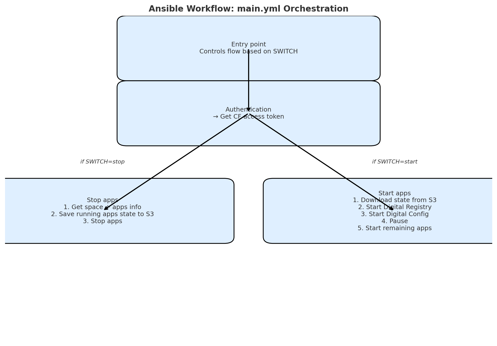
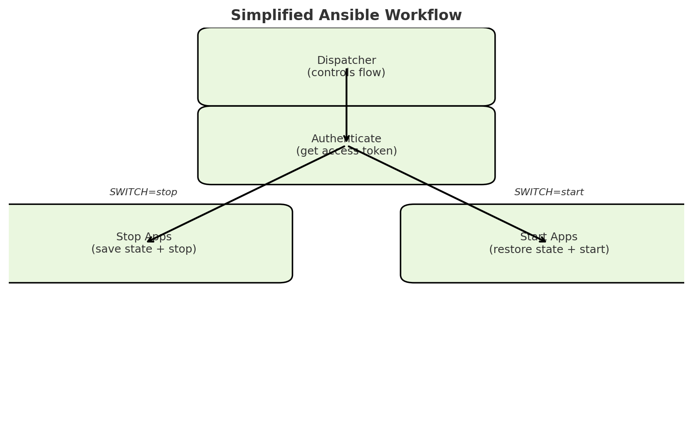

# Cloud Foundry App Power Saving (Ansible)

This project provides Ansible playbooks to **stop and start Cloud Foundry apps** in a safe and consistent way.
It saves the state of running apps before stopping them, and restores the same apps when starting again.

---

## 🚀 Workflow

1. **Authentication (`auth.yml`)**
   - Authenticates with Cloud Foundry UAA
   - Retrieves an OAuth access token

2. **Stop Apps (`cf_apps_stop.yml`)**
   - Retrieves app info for a given CF space
   - Saves running apps (names, GUIDs, states) to a YAML file
   - Uploads the state file to S3
   - Stops only apps that were previously running

3. **Start Apps (`cf_apps_start.yml`)**
   - Downloads the saved state file from S3
   - Starts apps in order:
     1. Digital Registry
     2. Digital Config
     3. Pause (1 minute for initialization)
     4. Remaining apps
   - Ensures only apps that were running before are restarted

4. **Main Dispatcher (`main.yml`)**
   - Always runs authentication first
   - Depending on `SWITCH`:
     - `SWITCH=stop` → runs `cf_apps_stop.yml`
     - `SWITCH=start` → runs `cf_apps_start.yml`

---

## 🔧 Variables

- `CF_USER` / `CF_PASS` → Cloud Foundry credentials
- `CF_API` → Cloud Foundry API endpoint
- `PROJECT` → Target CF space name
- `SWITCH` → Action to perform (`stop` or `start`)
- `DIGITAL_REGISTRY_NAME` → App name for Digital Registry
- `DIGITAL_CONFIG_NAME` → App name for Digital Config

---

## 📊 Workflow Diagram

### Detailed Flow


### Simplified Flow


---

## 📦 S3 Integration

- State files are stored in the S3 bucket: `cf-power-saving`
- Filename format: `status_<PROJECT>.yml`
- Ensures consistency when apps are restarted

---

## ✅ Example Usage

Stop apps in a space:
```bash
ansible-playbook main.yml -e "PROJECT=my-space SWITCH=stop"
````

Start apps in a space:
```bash
ansible-playbook main.yml -e "PROJECT=my-space SWITCH=start"
````
## Repository Structure

```bash
.
├── main.yml
├── auth.yml
├── cf_apps_stop.yml
├── cf_apps_start.yml
├── templates/
│   └── status_template.j2
└── docs/
    ├── workflow_detailed.png
    └── workflow_simple.png
````

